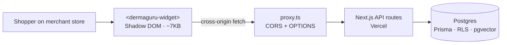
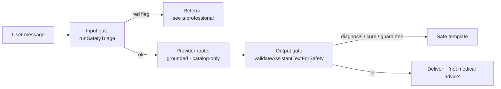
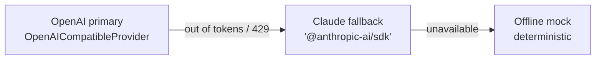
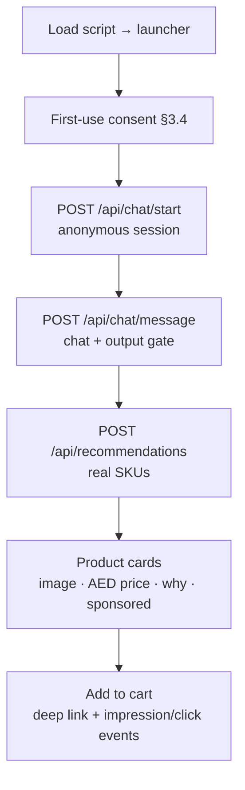

# DermaGuru — architecture, logic & flow

Visual references:

- **Widget design** → [`widget-design.svg`](./widget-design.svg) (LTR + RTL/Arabic, brand-tokened)
- **Logic & flow** → [`flows.svg`](./flows.svg) (delivery, safety pipeline, provider routing, widget flow)

DermaGuru is a multi-tenant, embeddable **cosmetic skincare advisor** (not a medical/diagnostic
tool). The spine is defense-in-depth safety; the AI is grounded only in the merchant's real catalog.

---

## 1. Delivery architecture

The widget mounts a Web Component in an **open Shadow DOM**, so the store's CSS can't bleed in and the
widget's CSS can't leak out. It talks to the app origin cross-origin; `proxy.ts` adds permissive CORS
(and answers `OPTIONS` preflights) for the widget-facing endpoints.

---

## 2. Safety pipeline (§3) — defense in depth

- **Input gate** (`src/services/safety-triage.ts`): deterministic triage → `LOW | CAUTION |
  REFER_CLINIC | URGENT`. `URGENT`/`REFER_CLINIC` block commercial recommendations.
- **Grounded LLM**: recommends only retrieved real catalog SKUs; never invents products or chooses the
  safety status.
- **Output gate** (`validateAssistantTextForSafety`): re-runs triage on the model's reply **and**
  catches diagnostic conclusions, disease-as-fact, treat/cure/prevent claims, and guaranteed-result
  claims. Flagged output is replaced with a safe template. Wired into **both** `/api/recommendations`
  and `/api/chat/message`.
- **UI**: persistent "Educational beauty guidance — not medical advice." line + first-use consent.

---

## 3. AI provider routing (§6) — OpenAI first, Claude when tokens run out

`getLLMProvider()` builds the chain from whichever provider keys are set. `FallbackLLMProvider` tries
each in order and falls back on `ProviderUnavailableError` (quota · rate-limit · auth · server ·
network). Genuine request bugs (e.g. a 400) propagate — they're never swallowed into the mock. Claude
uses §6.2 model routing: a quality-first synthesis model for routines, a fast/cheap model for chat +
intake classification (both overridable via env). `LLM_PROVIDER=mock` forces the offline path.

---

## 4. Widget interaction flow (§4)

Brand tokens (`--dg-primary`, `--dg-radius`, `--dg-font`, …) come from the embed `<script>`'s `data-*`
attributes; the tenant name + disclaimer come from `GET /api/widget/config`. RTL/Arabic is driven by
`data-locale="ar"` (or `data-rtl="true"`). Hostile-CSP environments fall back to the `/embed` iframe.

---

## 5. Multi-tenant isolation & grounding (§2 / §5 / §6.3)

`supabase/migrations/002_tenant_rls_and_pgvector.sql` adds Row-Level Security (GUC `app.current_tenant_id`,
fail-closed) to every tenant-scoped table, plus pgvector embeddings on `Product` and a `kb_chunks`
knowledge base with `match_products` / `match_kb_chunks` retrieval RPCs. RLS is enabled but not forced,
so the Prisma owner connection is unaffected; `src/lib/tenant-context.ts` (`withTenantContext`) is the
enforcement hook for a non-owner role.

---

## Key files

| Area | Path |
| --- | --- |
| Provider routing + Claude | `src/services/llm/provider.ts` |
| Safety gates | `src/services/safety-triage.ts` |
| Chat / recommendations APIs | `src/app/api/chat/message/route.ts`, `src/app/api/recommendations/route.ts` |
| Embeddable widget | `public/dermaguru-widget.js` |
| Widget config + CORS | `src/app/api/widget/config/route.ts`, `src/proxy.ts` |
| Tenant RLS + pgvector | `supabase/migrations/002_tenant_rls_and_pgvector.sql`, `src/lib/tenant-context.ts` |
